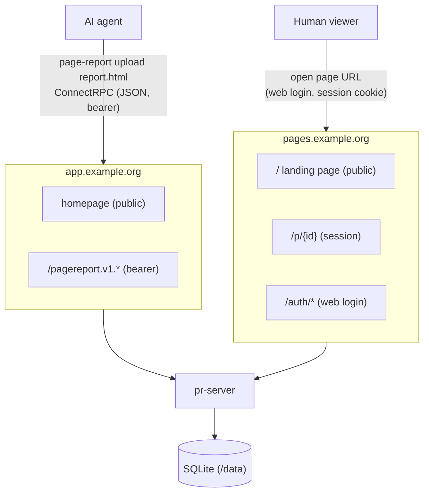

# page-report

Self-hosted service for publishing static HTML report pages generated by AI
agents. Agents upload pages through the `page-report` CLI and get back a
shareable URL; humans open that URL and authenticate against your identity
provider (GitHub or any OIDC IdP) to view the page. No web admin UI — the CLI
manages pages.

## Architecture



Two domains, one binary. The pages domain holds the (host-only) session
cookie and serves report HTML; the app domain is cookieless and serves the
bearer-authenticated API. This isolates uploaded — potentially untrusted —
HTML from the API and the app origin.

## Quickstart (Docker Compose)

1. Point two DNS names (e.g. `app.example.org`, `pages.example.org`) at the host.
2. Create `.env` next to `compose.yml`:

```sh
APP_DOMAIN=app.example.org
PAGES_DOMAIN=pages.example.org
PR_APP_BASE_URL=https://app.example.org
PR_PAGES_BASE_URL=https://pages.example.org
PR_SESSION_SECRET=<32+ random bytes>
PR_PROVIDER=oidc                       # or github
PR_ALLOWLIST=you@example.org
PR_OIDC_ISSUER=https://idp.example.org
PR_OIDC_CLIENT_ID=page-report
PR_OIDC_CLIENT_SECRET=...
```

3. `docker compose up --build -d`. Caddy terminates TLS for both domains.

## CLI

### Install

```sh
curl -fsSL https://raw.githubusercontent.com/dusansimic/page-report/main/install.sh | sh
```

The script picks the release asset for your platform, verifies its sha256
against the release `checksums.txt`, and installs the binary into
`~/.local/bin` (add that to your `PATH` if it isn't there). Two knobs:

| Env var | Default | Description |
|---|---|---|
| `PR_VERSION` | latest release | release tag to install, e.g. `v0.2.0` |
| `PR_INSTALL_DIR` | `$HOME/.local/bin` | where to put the binary |

Alternatives: grab a tarball from the [latest release][releases] by hand
(`linux` and `darwin`, `amd64` and `arm64`), or build from source with
`go build -o page-report ./cmd/page-report`. Untagged builds of `main` are
uploaded as `page-report-<os>-<arch>` artifacts on every [Build CLI][build-cli]
run. `page-report version` reports the build metadata.

[releases]: https://github.com/dusansimic/page-report/releases
[build-cli]: https://github.com/dusansimic/page-report/actions/workflows/build-cli.yml

### Updating

```sh
page-report update            # replace this binary with the latest release
page-report update --check    # report current vs latest, change nothing (--json for scripts)
page-report update --force    # reinstall the latest release even if it is not newer
```

The new binary is downloaded, checksum-verified and test-run before it
replaces the old one, so a failed update leaves the working binary in place.
Binaries built from source report a pseudo-version and `update` will happily
replace them with the latest release; if the install directory isn't writable
(a system-wide or package-manager install), `update` says so instead of
half-updating.

### Usage

```sh
mkdir -p ~/.config/page-report
echo 'server_url: https://app.example.org' > ~/.config/page-report/config.yml

page-report login                          # OAuth device flow against your IdP
page-report upload report.html --title "Weekly metrics"   # prints the page URL
page-report list [--json]
page-report get <id> -o report.html        # download stored HTML (stdout by default)
page-report delete <id>
page-report prune --older-than 30d
page-report logout
page-report update                         # self-update to the latest release
```

### Agent skill

The repo ships an agent skill that teaches this flow to coding agents. Install
it into a project with:

```sh
npx skills add dusansimic/page-report
```

It lives in `skills/page-report/`: `SKILL.md` (commands, CSP rules for the
uploaded HTML, troubleshooting), `examples/` (runnable shell scripts for
single/batch upload, scheduled prune, and a full agent loop) and `templates/`
(a CSP-safe report template plus a machine-readable `metadata.json` describing
every `--json` output).

## Configuration

### CLI

`$XDG_CONFIG_HOME/page-report/config.yml` (default
`~/.config/page-report/config.yml`), or an explicit path via `--config`:

| Key | Env var | Description |
|---|---|---|
| `server_url` | `PR_SERVER_URL` | server base URL (app domain) |

Precedence is `--server` > `PR_SERVER_URL` > config file; with none of the
three set, commands fail with `server URL required`. Credentials are stored
separately, next to the config file in `credentials.json` (mode `0600`).

### Server

YAML file (`--config` flag or `./config.yml`) with `PR_*` env overrides —
see `config.example.yml` for the full commented reference.

| Key | Env var | Default | Description |
|---|---|---|---|
| `listen_addr` | `PR_LISTEN_ADDR` | `:8080` | bind address |
| `app_base_url` | `PR_APP_BASE_URL` | — | public app URL (API + homepage) |
| `pages_base_url` | `PR_PAGES_BASE_URL` | — | public pages URL (reports + login) |
| `db_path` | `PR_DB_PATH` | `page-report.db` | SQLite file |
| `session_secret` | `PR_SESSION_SECRET` | — | ≥32 bytes, signs session cookies |
| `session_ttl` | `PR_SESSION_TTL` | `24h` | web session lifetime |
| `max_upload_bytes` | `PR_MAX_UPLOAD_BYTES` | `5242880` | upload size cap |
| `provider` | `PR_PROVIDER` | — | `github` or `oidc` |
| `allowlist` | `PR_ALLOWLIST` | — | emails / GitHub logins (comma-separated in env) |
| `github.client_id/_secret` | `PR_GITHUB_CLIENT_ID/_SECRET` | — | GitHub OAuth app |
| `oidc.issuer/client_id/client_secret/audience` | `PR_OIDC_*` | — | OIDC client (audience defaults to client_id) |
| `dev` | `PR_DEV` | `false` | allow http base URLs locally |

## Identity provider setup

**GitHub** — create a classic OAuth App: authorization callback URL
`https://<pages domain>/auth/callback`, and **enable device flow** in the app
settings. Allowlist entries are GitHub logins.

**OIDC** (Keycloak, Authentik, Zitadel, …) — create a confidential client
with redirect URI `https://<pages domain>/auth/callback` and the **device
authorization grant** enabled. Allowlist entries are email addresses. The
CLI sends the id_token as its bearer; the server verifies it against the
issuer's JWKS with `audience` (default: the client id).

## Security model

Every report page requires an authenticated, allowlisted identity — page ids
are random but are not the access control. Uploaded HTML is treated as
untrusted: it is served on a dedicated cookieless-API domain with a strict
CSP, and the session cookie is host-only so report scripts can never reach
the app domain or its API. Residual risk: a malicious report viewed by an
authenticated user could fetch *other reports* on the pages domain;
per-report tokens would close this and are a possible future hardening.

## Development

```sh
go build ./... && go test ./...
buf lint && buf generate        # after editing proto/
pre-commit install              # once; hooks: gofmt, vet, mod-tidy, buf
```

See `AGENTS.md` for conventions (package boundaries, migrations, config).

## License

[BSD 2-Clause](LICENSE)
