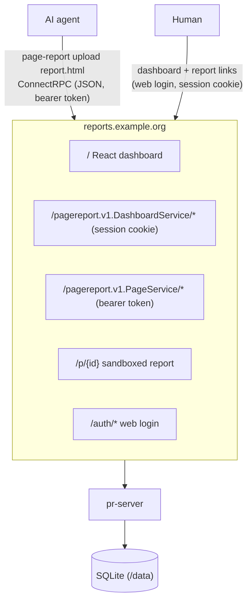

# page-report

Self-hosted service for publishing static HTML report pages generated by AI
agents. Agents upload pages through the `page-report` CLI and get back a
shareable URL; humans open that URL and authenticate against your identity
provider (GitHub or any OIDC IdP) to view the page. A small embedded web
dashboard lists your reports and manages the CLI tokens.

## Architecture



One origin, one binary. The dashboard is a React SPA embedded in the server.
Report HTML is attacker-controlled by assumption and is quarantined by a
`sandbox` CSP that gives every report an opaque origin — see
[Security model](#security-model).

## Quickstart (Docker Compose)

1. Point a DNS name (e.g. `reports.example.org`) at the host.
2. Create `.env` next to `compose.yml`:

```sh
BASE_DOMAIN=reports.example.org
PR_BASE_URL=https://reports.example.org
PR_SESSION_SECRET=<32+ random bytes>
PR_PROVIDER=github                     # or oidc
PR_ALLOWLIST=your-github-login
PR_GITHUB_CLIENT_ID=...
PR_GITHUB_CLIENT_SECRET=...
```

3. `docker compose up --build -d`. Caddy terminates TLS.
4. Open `https://reports.example.org`, sign in, and create a CLI token on the
   **Tokens** page.

## Web dashboard

Signing in lands you on `/dashboard`, which lists the reports you published:
open, copy link, or delete. `/tokens` manages the credentials the CLI uses.

A token is displayed **once**, when it is created — only a hash is stored, so
the server cannot show it again. If you lose one, rotate it. Rotating keeps the
token's name and id and issues a new secret, which invalidates the old one
immediately.

Creating or rotating a token requires having signed in within the last 10
minutes (`token_mint_reauth_window`); a longer-idle session is sent back
through the identity provider first. A token outlives the session that mints
it and works from any machine, so this keeps a stale tab from quietly
producing a permanent credential.

## Container image

Published to `ghcr.io/dusansimic/page-report` for `linux/amd64` and
`linux/arm64` (one manifest list; Docker picks the right one).

| Tag | Points at |
|---|---|
| `vX.Y.Z` | that exact release |
| `X.Y` | newest stable patch of that minor |
| `latest` | newest stable release — never untagged `main` |
| `main` | newest commit on `main` — unreviewed, moves often |
| `sha-<sha>` | one specific commit |

A prerelease (`v0.2.0-rc.1`) is published under its exact version only — it
never moves `X.Y` or `latest`.

```sh
docker run --rm ghcr.io/dusansimic/page-report:latest -version
```

`compose.yml` builds the image locally; point its `image:` at a published tag
instead to deploy without a build. The server reports its version on startup
and via `-version`; builds from source say `dev`.

## CLI

### Install

```sh
curl -fsSL https://raw.githubusercontent.com/dusansimic/page-report/main/install.sh | sh
```

The script picks the release asset for your platform, verifies its sha256
against the release `checksums.txt`, and installs the binary into
`~/.local/bin` (add that to your `PATH` if it isn't there). Two knobs:

| Env var | Default | Description |
|---|---|---|
| `PR_VERSION` | latest release | release tag to install, e.g. `v0.2.0` |
| `PR_INSTALL_DIR` | `$HOME/.local/bin` | where to put the binary |

Alternatives: grab a tarball from the [latest release][releases] by hand
(`linux` and `darwin`, `amd64` and `arm64`), or build from source with
`go build -o page-report ./cmd/page-report`. Untagged builds of `main` are
uploaded as `page-report-<os>-<arch>` artifacts on every [CI][ci] run.
`page-report version` reports the build metadata.

[releases]: https://github.com/dusansimic/page-report/releases
[ci]: https://github.com/dusansimic/page-report/actions/workflows/ci.yml

### Updating

```sh
page-report update            # replace this binary with the latest release
page-report update --check    # report current vs latest, change nothing (--json for scripts)
page-report update --force    # reinstall the latest release even if it is not newer
```

The new binary is downloaded, checksum-verified and test-run before it
replaces the old one, so a failed update leaves the working binary in place.
Binaries built from source report a pseudo-version and `update` will happily
replace them with the latest release; if the install directory isn't writable
(a system-wide or package-manager install), `update` says so instead of
half-updating.

### Usage

```sh
mkdir -p ~/.config/page-report
echo 'server_url: https://reports.example.org' > ~/.config/page-report/config.yml

page-report login                          # paste a token from the Tokens page
page-report whoami                         # which identity and token is in use
page-report upload report.html --title "Weekly metrics"   # prints the page URL
page-report list [--json]
page-report get <id> -o report.html        # download stored HTML (stdout by default)
page-report delete <id>
page-report prune --older-than 30d
page-report logout                         # forget the stored token
page-report update                         # self-update to the latest release
```

`login` prompts for the token without echoing it. For scripts and CI:

```sh
echo "$TOKEN" | page-report login --token-stdin   # store it
PR_TOKEN=prt_... page-report upload report.html   # or skip storing entirely
```

`PR_TOKEN` takes precedence over the stored credentials.

Listing, downloading, deleting and pruning only ever touch your own reports.
Report links themselves stay shareable: any allowlisted person can open one.

### Agent skill

The repo ships an agent skill that teaches this flow to coding agents. Install
it into a project with:

```sh
npx skills add dusansimic/page-report
```

It lives in `skills/page-report/`: `SKILL.md` (commands, CSP rules for the
uploaded HTML, troubleshooting), `examples/` (runnable shell scripts for
single/batch upload, scheduled prune, and a full agent loop) and `templates/`
(a CSP-safe report template plus a machine-readable `metadata.json` describing
every `--json` output).

## Configuration

### CLI

`$XDG_CONFIG_HOME/page-report/config.yml` (default
`~/.config/page-report/config.yml`), or an explicit path via `--config`:

| Key | Env var | Description |
|---|---|---|
| `server_url` | `PR_SERVER_URL` | server base URL |
| — | `PR_TOKEN` | API token; overrides the stored credentials |

Precedence for the server URL is `--server` > `PR_SERVER_URL` > config file;
with none of the three set, commands fail with `server URL required`. The token
is stored separately, next to the config file in `credentials.json` (mode
`0600`).

### Server

YAML file (`--config` flag or `./config.yml`) with `PR_*` env overrides —
see `config.example.yml` for the full commented reference.

| Key | Env var | Default | Description |
|---|---|---|---|
| `listen_addr` | `PR_LISTEN_ADDR` | `:8080` | bind address |
| `base_url` | `PR_BASE_URL` | — | public base URL (everything is served here) |
| `db_path` | `PR_DB_PATH` | `page-report.db` | SQLite file |
| `session_secret` | `PR_SESSION_SECRET` | — | ≥32 bytes, signs session cookies |
| `session_ttl` | `PR_SESSION_TTL` | `24h` | web session lifetime |
| `max_upload_bytes` | `PR_MAX_UPLOAD_BYTES` | `5242880` | upload size cap |
| `token_default_ttl` | `PR_TOKEN_DEFAULT_TTL` | `0` | expiry preselected for new tokens (`0` = never) |
| `token_mint_reauth_window` | `PR_TOKEN_MINT_REAUTH_WINDOW` | `10m` | how fresh a session must be to mint a token (`0` disables) |
| `provider` | `PR_PROVIDER` | — | `github` or `oidc`, for web login |
| `allowlist` | `PR_ALLOWLIST` | — | emails / GitHub logins (comma-separated in env) |
| `github.client_id/_secret` | `PR_GITHUB_CLIENT_ID/_SECRET` | — | GitHub OAuth app |
| `oidc.issuer/client_id/client_secret` | `PR_OIDC_*` | — | OIDC client |
| `dev` | `PR_DEV` | `false` | allow an http base URL locally |

## Upgrading from the two-domain layout

Earlier versions served the API and the report pages on two separate domains
and authenticated the CLI with an OAuth device flow. Both changed:

1. **Config.** `app_base_url` → `base_url`; `pages_base_url` is gone.
   `app_base_url` is still read for one release, with a warning, so the server
   keeps booting. `oidc.audience` was removed.
2. **OAuth callback.** Update the app's authorization callback URL to
   `https://<base_url>/auth/callback`. Device flow no longer needs to be
   enabled.
3. **Report links.** Page URLs are built from `base_url` at read time, so links
   shared as `https://<pages domain>/p/{id}` stop resolving. Keep the old
   hostname pointed at the server and redirect it — there is a ready Caddy
   block in the `Caddyfile`.
4. **CLI credentials.** Device-flow credentials are rejected with a message
   telling the user to run `page-report login` again. Create a token in the
   dashboard first.

Existing reports keep working and stay attached to whoever created them: rows
written before the ownership column are matched on their `created_by` label.

## Identity provider setup

The identity provider is used for **human web login only**. CLI credentials are
tokens this server mints, so nothing about the CLI touches the IdP.

**GitHub** — create a classic OAuth App with authorization callback URL
`https://<base_url>/auth/callback`. Allowlist entries are GitHub logins.

**OIDC** (Keycloak, Authentik, Zitadel, …) — create a confidential client with
redirect URI `https://<base_url>/auth/callback`. Allowlist entries are email
addresses.

## Security model

Every report page requires an authenticated, allowlisted identity — page ids
are random but are not the access control. Uploaded HTML is treated as
untrusted, and three controls keep it inert:

- **Sandbox CSP.** Reports are served with a `sandbox` CSP carrying neither
  `allow-same-origin` nor `allow-scripts`, so each renders in an opaque origin:
  no JavaScript, no access to the session cookie, no reads of other reports, no
  service worker. This holds even though reports share a host with the app.
- **Content-type allowlist.** Uploads may only declare `text/html` or
  `text/plain`; the value is stored canonicalised and re-checked when served,
  so nothing can be smuggled in as a scriptable document type such as
  `image/svg+xml`.
- **`Sec-Fetch-Dest` gate.** Requests to a report, or to the CLI API, carrying
  a `Sec-Fetch-Dest` other than `document` are refused. Reports are only ever
  loaded as top-level documents, and the CLI API is deliberately unreachable
  from a browser.

The browser dashboard is the one surface that accepts script-initiated
requests. It uses a separate service (`DashboardService`), authenticates with
the session cookie, and requires a same-origin `Origin` header; no CORS handler
is registered, so cross-origin callers fail their preflight.

Note that these three controls are **not layered behind an origin boundary**.
An earlier version put reports on a second domain; that was collapsed
deliberately, trading a boundary for a much simpler deployment on the grounds
that this is a self-hosted service for a small set of trusted users. The
consequence is that the controls above are load-bearing rather than redundant.
Do not weaken them.

## Development

```sh
go build ./... && go test -race ./...     # works without a Node toolchain
pnpm --dir web/app install
pnpm --dir web/app build                 # embed the dashboard into the binary
buf lint && buf generate                 # after editing proto/
```

`go build` works on a clean checkout without Node: `web/app/dist` ships a
`.gitkeep` so the embed resolves, and a server built that way answers the
dashboard routes with a 503 explaining the missing build step.

There are no git hooks: CI is the gate. Every check it runs has a local
equivalent listed under "Commands" in `AGENTS.md` — `gofmt -w .`,
`go mod tidy`, `golangci-lint run ./...`, `buf format -w`,
`pnpm --dir web/app lint`, `shellcheck`, `actionlint`.

### Local development

The browser has to see the SPA and the API on one origin, so the Vite dev
server owns the page and proxies the API, auth and report paths to the Go
server. In `config.yml`:

```yaml
dev: true
base_url: "http://localhost:5173"
```

Then `mprocs` (config in `mprocs.yaml`) runs both processes; open
`http://localhost:5173`.

See `AGENTS.md` for conventions (package boundaries, migrations, config).

## License

[BSD 2-Clause](LICENSE)
